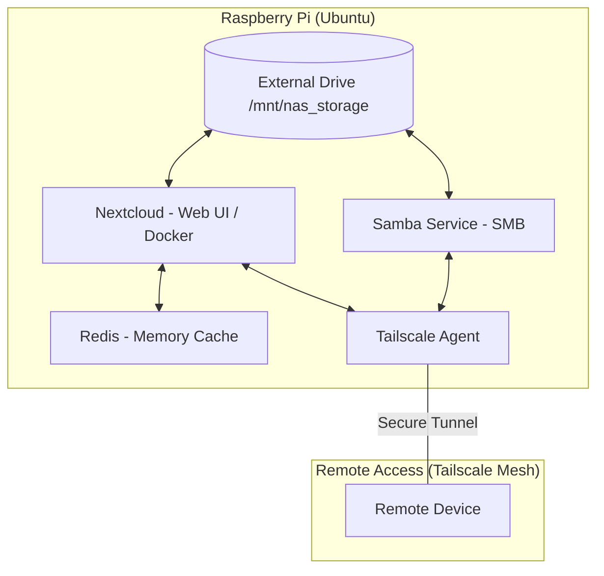

# Raspberry Pi Personal NAS & Cloud Server


Turn your Raspberry Pi into a **secure personal NAS + cloud server** with remote access — no port forwarding required.

---

## 📌 Table of Contents

* [Features](#-features)
* [System Architecture](#-system-architecture)
* [Tech Stack](#️-tech-stack)
* [Installation Guide](#️-installation-guide)

  * [1. Storage Setup](#1-storage-setup)
  * [2. Samba Setup](#2-samba-setup)
  * [3. Tailscale Setup](#3-tailscale-setup)
  * [4. Nextcloud + Redis (Docker)](#4-nextcloud--redis-docker)
* [Accessing Your NAS](#-accessing-your-nas)
* [Security](#-security)
* [Common Isssues](#-troubleshooting)

---

## ✨ Features

* Local file sharing via **Samba (SMB)**
* Personal cloud using **Nextcloud**
* Secure remote access via **Tailscale (WireGuard)**
* Faster performance using **Redis caching**
* Docker-based isolated deployment

---

## 🧱 System Architecture



---

## ⚙️ Tech Stack

| Component    | Purpose              |
| ------------ | -------------------- |
| Raspberry Pi | Host system          |
| Ubuntu       | OS                   |
| Samba        | File sharing         |
| Nextcloud    | Web-based cloud      |
| Redis        | Caching              |
| Docker       | Containerization     |
| Tailscale    | Secure remote access |

---

## 🛠️ Installation Guide

### 1. Storage Setup

```bash
lsblk
sudo mkfs.ext4 -n "8G_PD" /dev/sda1
sudo mount /dev/sda1 /mnt/nas_storage/
sudo chown -R $USER:$USER /mnt/nas_storage/
sudo chmod -R 755 /mnt/nas_storage/
```

Get UUID:

```bash
sudo blkid
```

Add to `/etc/fstab`:

```
UUID=STORAGE-UUID-HERE /mnt/nas_storage ext4 defaults 0 2
```

---

### 2. Samba Setup

```bash
sudo apt install samba
sudo nano /etc/samba/smb.conf
```

Add:

```
[PiNAS]
path = /mnt/nas_storage
browseable = yes
writable = yes
guest ok = no
read only = no
```

Set password:

```bash
sudo smbpasswd -a $USER
sudo systemctl restart smbd
```

---

### 3. Tailscale Setup

```bash
curl -fsSL https://tailscale.com/install.sh | sh
sudo tailscale up
tailscale ip -4
```

---

### 4. Nextcloud + Redis (Docker)

Create `docker-compose.yml`:

```yaml
version: "3"
services:
  nextcloud:
    image: lscr.io/linuxserver/nextcloud:latest
    container_name: nextcloud
    environment:
      - PUID=1000
      - PGID=1000
      - TZ=Asia/Kolkata
    ports:
      - 8080:80
    volumes:
      - ./config:/config
      - /mnt/nas_storage:/data
    restart: unless-stopped
    depends_on:
      - redis

  redis:
    image: redis:alpine
    container_name: redis
    restart: unless-stopped
```

Run:

```bash
docker-compose up -d
```

---

### 🔧 Enable Redis in Nextcloud

Edit `config.php`:

```php
'memcache.local' => '\\OC\\Memcache\\APCu',
'memcache.distributed' => '\\OC\\Memcache\\Redis',
'memcache.locking' => '\\OC\\Memcache\\Redis',
'redis' => 
array (
  'host' => 'redis',
  'port' => 6379,
),
```

---

## 🌐 Accessing the NAS

| Platform | Method                       |
| -------- | ---------------------------- |
| Windows  | `\\100.x.x.x\PiNAS`          |
| macOS    | `smb://100.x.x.x/PiNAS`      |
| Linux    | `smb://100.x.x.x/PiNAS`      |
| Browser  | `http://<tailscale-ip>:8080` |

---

---

## 🔒 Security

* No port forwarding
* Encrypted WireGuard tunnel via Tailscale
* Authenticated SMB access only
* Isolated services using Docker

---

## 🧪 Common Issues

| Issue                  | Solution                              |
| ---------------------- | ------------------------------------- |
| Samba not visible      | Restart `smbd` service                |
| Permission denied      | Check ownership of `/mnt/nas_storage` |
| Nextcloud slow         | Ensure Redis is running               |
| Cannot access remotely | Verify Tailscale connection           |

---
